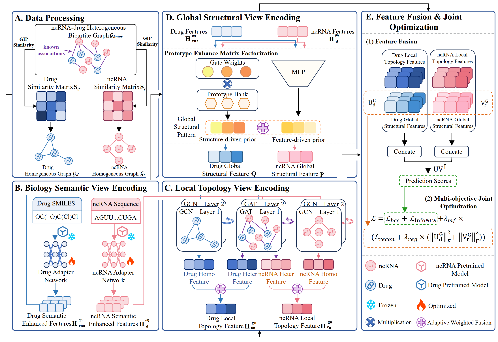

# TRICUS
The project of TRICUS
## TRICUS
The framework of TRICUS is as follows:



## Environmental Dependencies and Configuration

### Install dependencies

The project dependencies have been written in 'requirements. txt' and can be installed directly:

```bash
pip install -r requirements.txt
```
```aiignore
PS: torch: 2.4.0, cuda: 12.4
```
### Configurations

The default training parameters are defined in `options/base_options.py` and `options/train_options.py`. Common configurations include:

- `--name`: name of the experiment, default `TRICUS`
- `--checkpoints_dir`: frames are saved here, default`./logger`
- `--niter`: training epochs, default `200`
- `--lr`: base learning rate, default `1e-5`
- `--gcn_layers`: layer numbe for GCN, default `2`
- '--gat_layers': layer numbe for GAT, default `2`
- `--gmf_num_prototypes`: number of shared prototypes in TRICUS, default `64

## Project structure

- `main.py`：main function
- `fold_info.pickle`：5-fold partition information and training/testing index

### `data/`

- `ncrna-drug_split.csv`：association matrix
- `rna_seq.csv`：ncRNA sequence
- `drug_smiles.csv`：drug SMILES
- `lncRNA_embeddings_RiMALMo.npy`：lncRNA pre-trained embeddings
- `miRNA_embeddings_RiMALMo.npy`：miRNA pre-trained embeddings
- `drug_embeddings.npy`：drug pre-trained embeddings

### `models/`

- `model.py`：Core model framework

### `networks/`

- `trainer.py`：Trainer packaging

### `option/`

- `base_options.py`：Basic command-line parameter
- `train_options.py`：TRICUS training parameter

### `utils/`

- `utils.py`：General utility functions, such as random seed setting, logging, etc

## Quick Start


```bash
python main.py
```
The script will default to executing a 5-fold training process and save the results to `./logger/TRICUS/`.

If you need to specify a GPU or modify training parameters, you can run it like this:

```bash
python main.py --device cuda --gpu_ids 0 --niter 200 --lr 1e-5
```
